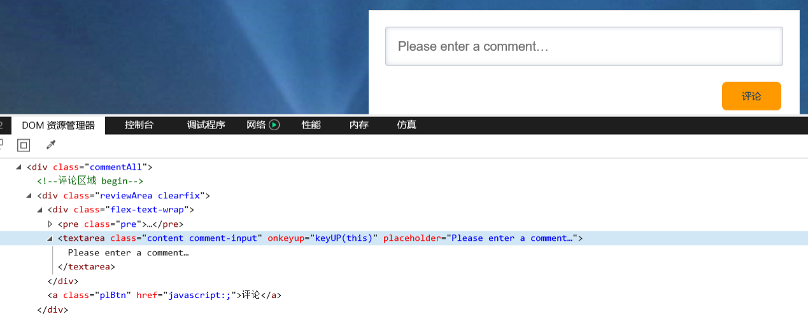
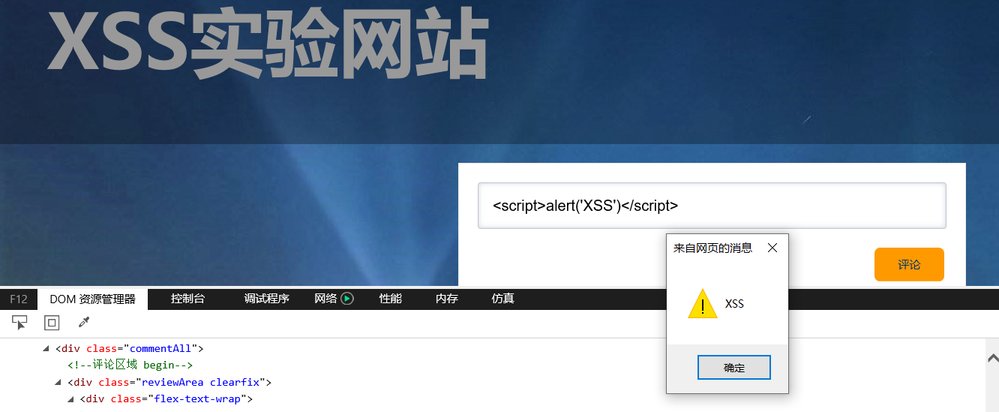

# XSS实验

## 一、实验目的
* 搭建简易网站作为实验环境，通过测试脚本测试XSS漏洞  

## 二、实验原理
* XSS攻击通常指的是通过利用网页开发时留下的漏洞，通过一些方法注入恶意指令代码到网页，使用户加载并执行攻击者恶意制造的网页程序。这些恶意网页程序通常是JavaScript，但实际上也可以包括Java、 VBScript、ActiveX、 Flash 或者甚至是普通的HTML。

## 三、实验内容
* 测试网站搭建    

* 表单中填写“<script>alert('XSS')</script>”，提交到后端，攻击成功      
    

## XSS防御
### 页面上直接输出的所有不确定(用户输入)内容都进行html转译
* 也就是将所有的[<,>,”,,&]等符号都用[<,>,",&]字符进行替换，这些html标签符号被替换后，浏览器就会拿它当作一个普通字符串对待，而不是当作一个标签的开始/结束标志对待。 
比如下面的攻击代码在输出前进行转移
```
String content = "<script>alert('ok');</script>";
content= StringEscapeUtils.escapeHtml4(content);
# 被转后后成为了&lt;script&gt;alert('ok');&lt;/script&gt;字符串，然后再输出到浏览器 
```
* 浏览器就不会将转译后的字符串当中脚本执行，而是直接输出一个字符串，这样就已经能防御大部分xss攻击了

### `<a>`标签的href属性中不要包含不确定(用户输入)的内容
* 上面的转译能够解决直接输出在html中的内容，原理是将脚本标签中的<>等符号转译替换掉，但是还有一些情况下执行脚本，是不一定要依赖标签的，也就是脚本不需要用<script></script>包住，那么转译对这种脚本就不起作用了，比如a标签中的href属性，除了直接指定一个url进行跳转，还可以通过javascript:xxx();的方式执行js代码

### 对用户输入内容格式做校验
* 假如服务端校验了博客地址是否是一个url格式、用户名是否包含特殊字符等信息，也就不会发生上面这些攻击了，所以服务端最好对用户输入的内容都进行格式校验
