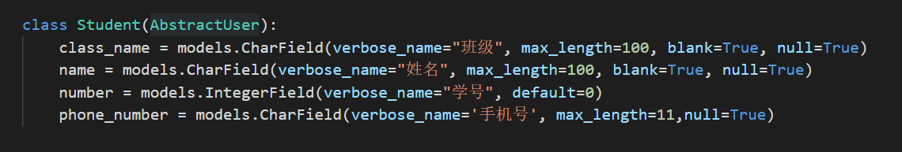
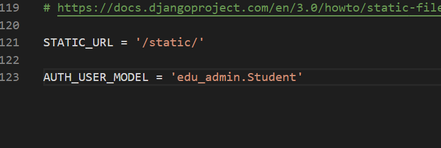

# web程序设计和SQL注入

## 一、实验要求
* 以django为例，演示web开发的主要流程，理解sql注入的基本原理，分析sql注入和xss在django框架下是如何被解决的

## 二、实验内容
### （一）安装 django
```
pip install Django
python -m pip install Django
# 第一步，安装 django

django-admin startproject mysite
cd  mysite
python manage.py startapp polls
python manage.py runserver
```
* 四个命令，构建了一个基于Django的基本框架的web应用程序
* 访问 `http://127.0.0.1:8000/`，可以看到结果
* 以上操作，是[Django官方文档推荐的教程](https://docs.djangoproject.com/en/3.0/intro/tutorial01/)    
   
   
* 在命令行里，可以看到服务器的打印输出，表示服务器收到了 request，看到的页面就是框架自动返回给大家的response，说明，request和response，请求相应的处理过程已经搭建起来了

### （二）做一个简单的教务系统
### *基础知识*
#### MVC
* 编写大型程序的时候，一定要做到`mvc分离`
    * `m数据模型`，我们要先建立基础的底层的数据结构
    * 然后在处理用户输入，构建每个用户输入对应的处理函数。就是`c 控制`
    * 然后，在底层m数据模型的基础上，绘制用户界面
* 写Django的程序，或者任何框架程序。主要就是写三大部分，`第一，数据模型，models`，`第二，views和url`。是用户请求对应的处理程序。`第三，前端页面模板`。处理完的结果如何显示的问题
    * 其中url部分，又称为路由。是`把用户请求的url，对应到处理函数的过程`。`Django的处理函数`，有一个专门名称，叫views。其基本过程：
        * 框架收到用户的request ，其中有URL
        * 框架根据urls.py中的配置，将用户请求对应到一个处理函数，一般在views.py中
        * views.py中的函数，参数就是request对象，Django中是HttpRequest类。然后views函数需要返回一个HTTPResponse类型的request，Django把这个reqeust变化为http协议的request数据包，返回给浏览器。一般在views的处理过程中，会访问数据库，也就是models
        * models把底层的数据库操作，比如sql全部封装为了对象化的处理。比如底层操作数据库是用sql语句，所以我们最原始的web程序，一般会程序员拼装sql语句。但是在Django中不用，我们把这种`底层数据的封装，称为orm`，Object-relational Mappe
#### 数据库
* 数据库分两种，一种叫`关系型数据库`，一种叫`非关系型数据库`。其中教务系统这种信息管理类的软件，一般是使用关系型数据库。`关系型数据库的基本结构是表`。关系其实是指`表与表之间的关系`
* 使用数据库
    * 首先就是`设计数据库表结构`
        * Django最方便的一点，就是`把建表这种基本操作编程了python中的类的定义`。所定义的这些类，直接继承models.Model，所有的建表的操作框架就可以完成

### *实验步骤*
#### 1.建立基础的底层的数据结构
* 写好models.py文件
* 再建一个app ，比如叫 edu_admin
```
python manage.py startapp edu_admin
```
* 然后用vscode打开工程
```
code .
```     
   
* 编写的models.py直接是edu_admin中的models.py
* 然后需要把这个表结构，真实的写入到数据库中。也就是create table的过程，django称为migrate
    * 打开 mysite 的 settings.py ，`在INSTALLED_APPS这里增加一个 edu_admin`，表示 edu_admin 这个是site的一个app。之前startapp命令只是创建了app，必须要把app写入到这里，这个app才会被纳入到站点功能中
    * `python .\manage.py makemigrations`、`python .\manage.py migrate`，会有这样的结果    
        
    * makemigrations成功的标志是在app的目录下有migrations目录
        
        
    * 然后会出现一个 db.sqlite3文件，数据库表结构就建立完成了
    * Django这里默认使用了sqlite这种简单的文件型数据库。这种数据库的好处是不用按照，就是一个文件来保存数据的所有信息，适合轻量级小规模的应用。但是效率和容量都有效。一般用在开发调试环境，不用在生产环境  
* 为了验证Django真的建立了表，下载一个sqlite的客户端软件，来看一下它的表结构   
    * 把sqlite3.exe加入在PATH环境变量，或者放在db.sqlite同一个目录
    * `sqlite3.exe db.sqlite3`执行这个命令，进入到sqlite的命令行以后
    * 执行 .table命令，可以看到所有的表，其中这三个表是在models中定义的。其他表是Django自己要用的。
        
    * 执行sql语句，插入一条记录。insert和select可以成功，说明表是好的
#### 2.编写VIEW
* views是Django功能实现应用功能的地方。如果想写一个动态的页面，就在views中定义一个函数。这是最基本的方法，在此基本的方法上还可以有高级的，系统内置的一些高级的数据库增删改查的方法
* 最基本的views函数，是`收到一个HttpRequest类型的参数，需要返回一个HTTPResponse类型的返回值`，和http协议对应    
#### 在view.py中编写一个函数     
     
* 写好了以后，需要把这个views，对应到一个路径上
#### 在 edu_admin中建一个urls.py文件，写入如下内容      
    
#### 在主 urls.py ，也就是mysite的urls.py中包括这个url配置
* 这是为了适应，可能有多个Django app共同工作的情况，比如这里的edu_admin是一个app，polls又是一个app      
   
#### 在mysite目录下使用`python manage.py runserver`命令运行网站
#### Run之后访问 127.0.0.1:8000    
* 看到这个结果      
   
* 这个是404页面。说明我们访问的url路径并不存在。只有 edu/ 和admin/两个路径存在
#### 访问 http://127.0.0.1:8000/edu/index
* 看到页面     
   
* 说明urls和views配合工作成功。用户在浏览器中输入路径，django把这个url对应到一个views函数上。views函数处理HttpRequest。返回HttpResponse
* 把url对应到一个views函数的过程，专业术语叫`“路由”`，为 web程序中url和处理函数的对应关系。一个url是可以带参数的，views函数也是可以带参数的，比如      
   
   
* pk就是参数，而且只允许整数。路由系统会把这个参数赋值传递给views函数的pk参数。
* 这么改一下，就可以有一个动态的效果     
   
#### 3.在views函数中访问数据库
* 修改view.py     
   
* `Score.objects.filter(student=request.user)`
* Django是有默认的用户管理系统的。用户相关的数据库表结构Django已经建立好了
#### 修改模型
* 首先在 models.py中导入`from django.contrib.auth.models import AbstractUser`,(这个是Django默认的用户管理的数据库模型)然后继承修改之      
   
* AbstractUser已经有很多数据库字段了，比如密码肯定是需要以某种方式保存到数据库中的
* Student继承了AbstractUser后。告诉Django用Student作为系统用户管理的数据库模型。在mysite settings.py也就是整个站点的配置文件中，增加一条`AUTH_USER_MODEL = 'edu_admin.Student'`。     
      
* 告诉Django，使用 edu_admin 的Student作为用户管理登录授权的模型。
* 代码修改完以后，涉及到数据库修改，所有要进行数据库表结构的migrate    
```
python manage.py makemigrations 
# 输入选择1
# 输入参数空字符串' '
python manage.py migrate
```
* 前一步生成迁移文件，后一步实施迁移          
     
* 下面，尝试在数据库中写入一些数据。然后测试看看Django的数据库访问是否正常
* 最原始的方法就是在sqlite.exe 中用sql语句插入。但是这个方法容易把数据搞乱了，而且比如用户密码这样的东西，不是明文保存的，所有插入会有问题。
* 用Django的方式，先建立一个超级用户
* `python manage.py createsuperuser`建立一个管理员账户。
* 建立好了以后，用sqlite3.exe可以看到Student表多了一条记录。     
     
* 然后可以用Django的admin功能，用超级管理员录入数据。Django的admin相当于一个数据管理的超级权限后台，可以直接操作数据库。
* 在admin.py中录入以下内容      
     
* 这样直接就可以生成一个管理数据库的后台页面。
* 访问 http://127.0.0.1:8000/admin/ 刚才新建的用户登录后看到这个页面。可以录入一些课程，学生和成绩了               
     
     
#### 在页面中添加数据
* 当数据库有了值以后，就可以在view中验证，查询自己成绩的功能是否正常了。
* views中的@login_required表示需要登录。这里已经用超级管理员登录了，所以是可以访问的。
#### *`render函数`*
* render是一个Django内置的函数。用于在模板文件的基础上，通过渲染得到动态的网页效果。其中 score.html是模板，后面的{} dict是参数       
     
* render必须传参reqeust，然后render函数就会在模板html文件的基础上，生成一个html，并返回 HTTPResponse，所以可以直接作为 views函数的返回。
#### 在templates目录下编写一个score.html     
     
     
* 这里的result就是render传入的result，对每一个result 显示其课程名和分数
* 注意，写了新的views函数，需要增加url        
     
* 这就完成了当前登录用户（超级管理员 admin 同学）的成绩查询。       
     

* 注意，实际情况，`并不是每个用户都是超级管理员。需要有普通用户登录注册页面`。实际情况下`普通用户是不能访问 127.0.0.1:8000/admin页面的`。

### sql_injections.py中的漏洞
* sql_injections.py是独立运行py文件
* 在vscode中调试，增加launch.json的配置       
* 在调试界面，点击 “增加配置”，选python 当前文件，然后在 launch.json中，增加配置项       
       
* 用这种方式可以调试sql_injection，然后点击sql_inejction文件，使其成为编辑器的当前文件，就可以调试了
* 运行以后，是一个编辑框，输入学生ID，查询对应的成绩
* 通过直接查询数据库，我们知道当前的用户的ID是1，所以输入1，查询。返回了用户id 1的成绩
        
* 如果数据库中有多个用户，还可以查询Id为2和3的用户的成绩。`sql_inject漏洞`就出现在这里。
* 当输入这样的内容提交
        
* 查出了当前系统中所有用户的成绩，相当于整个数据库都获得了
       
* 问题在`代码的43行`，我们直接把用户输入的数据，作为sql语句中的查询条件。最后的 sql语句为：
```
SELECT edu_admin_course.name, edu_admin_score.score FROM edu_admin_score INNER JOIN edu_admin_course ON edu_admin_score.course_id=edu_admin_course.id WHERE student_id = 1 OR 1=1
```
* `查询条件变成了 student_id = 1 OR 1=1`
* 1=1恒为真，任何数OR真值，也是真。所以，相当于 
```
SELECT edu_admin_course.name, edu_admin_score.score FROM edu_admin_score INNER JOIN edu_admin_course ON edu_admin_score.course_id=edu_admin_course.id WHERE true;
```
* 变成了无条件查询，于是显示出了数据中的所有记录。可见，在软件安全中，有一个原则，所有用户的输入都是不可信的。因此，必须对用户输入进行过滤。进行严格的限制

### 改进
* 方法一：对用户输入进行过滤，比如可以判断一下 input_data
是否数字就可以。用python内置函数 isdigit就可以判断，在这个具体的漏洞可以采用这种方法。
* 方法二：对于大型的系统，会有很多sql语句拼接和执行的地方。每一个都去过滤，编程效率很低，而且不一定能保证你写的过滤就是对的。实际系统的业务远比我们这里输入ID要复杂。ORM完全避免了程序员直接接触sql语言，所有的sql语句都在模型管理器中有框架进行拼接。程序员在编程时，只需要使用模型管理器提供的方法进行查询，创建等，就可以了。
    * 比如，之前写的Django代码
    ```
    result = Score.objects.filter(student=request.user)
    ```
    * 在底层进行sql的拼接，就避免了这种情况


- - -
## *参考资料*
* [sqlite3](https://docs.python.org/3/library/sqlite3.html)