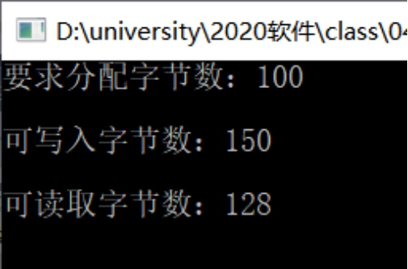
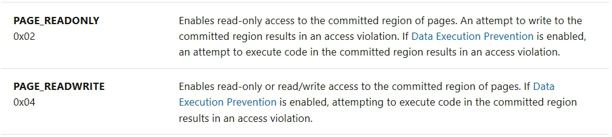
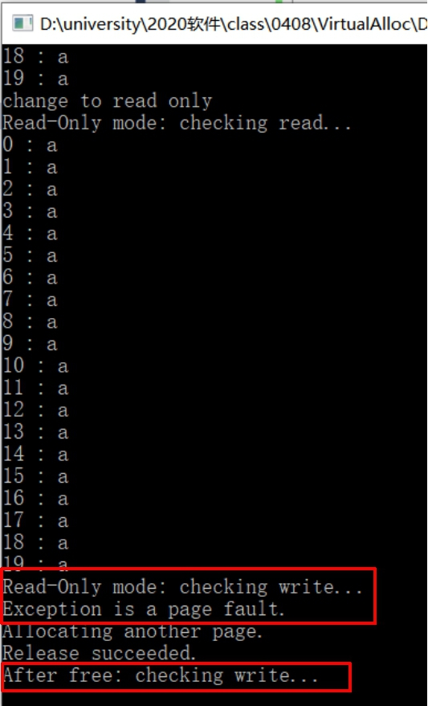

# 内存管理

## 一、实验要求
* 阅读VirtualAlloc、VirtualFree、VirtualProtect等函数的官方文档。
* 编程使用malloc分配一段内存，测试是否这段内存所在的整个4KB都可以写入读取。
* 使用VirtualAlloc分配一段，可读可写的内存，写入内存，然后将这段内存改为只读，再读数据和写数据，看是否会有异常情况。然后VirtualFree这段内存，再测试对这段内存的读写释放正常。

## 二、实验内容
### （一）使用malloc分配一段内存
#### 前驱知识
* 在malloc分配空间时是在Heap上分配的，在对虚拟内存地址到物理内存地址进行转换时，内核会对地址的正确性进行检查，如果地址是合法的，内核就会提供对应的物理内存分页；如果是申请内存空间，内核就会检查空余的物理内存分页，并加以分配，如果物理内存空间不足，内核会拒绝此次申请。
* 真正的地址有效还是无效是以分页为单位的，以4KB（页）作为基本管理单元的虚拟内存管理。
* CHAR 类型数据占 1 个字节，4KB 为 4096 个字节

#### 实验结果
* 如果字节数大于4096，无法正常运行，既不能写入，也不能读取。调试时出现了溢出报错。这是因为写入和读取的长度超过了基本管理单元4KB，判定为无效。 
* 如果字节数刚好等于4096或小于4096，可以正常运行，可以写入，也可以读取，但写入字节数和读取字节数不一样。因为只要求分配100字节，写入时出现了堆损坏报错，写入时超出了已分配的长度，覆盖了多余的内存因此读取为128字节。        
     

### （二）使用VirtualAlloc分配内存
#### VirtualAlloc
* 用于在调用进程的虚地址空间,预定或者提交一部分页。如果用于内存分配的话,并且分配类型未指定MEM_RESET,则该内存自动被初始化为0
```
LPVOID VirtualAlloc{
    LPVOID lpAddress, // 要分配的内存区域的地址
    DWORD dwSize, // 分配的大小
    DWORD flAllocationType, // 分配的类型
    DWORD flProtect // 该内存的初始保护属性
};
```
* LPVOID lpAddress, 分配内存区域的地址。当使用VirtualAlloc来提交一块以前保留的内存块的时候，lpAddress参数可以用来识别以前保留的内存块。如果这个参数是NULL，系统将会决定分配内存区域的位置，并且按64-KB向上取整(roundup)。
* SIZE_T dwSize, 要分配或者保留的区域的大小。这个参数以字节为单位，而不是页，系统会根据这个大小一直分配到下页的边界DWORD
* flAllocationType, 分配类型 ,可以指定或者合并以下标志：MEM_COMMIT，MEM_RESERVE和MEM_TOP_DOWN。       
     
* DWORD flProtect 指定了被分配区域的访问保护方式       
     

#### VirtualFree
* 用于取消或者释放调用进程的虚地址空间页的一个区域，释放一块调用VirtualAllocEx函数分配的内存(包括虚拟内存)
```
BOOL VirtualFreeEx{
    HANDLE hProcess, // 要释放内存所在进程的句柄
    LPVOID lpAddress, // 区域地址
    DWORD dwSize, // 区域大小，字节
    DWORD dwFreeType //类型
};
```
* LPVOID lpAddress, 要释放的页的区域的地址,如果dwFreeType指定为MEM_RELEASE且这个区域是被保留的话,那么这个地址就要指定为分配区域的首地址
* SIZE_T dwSize, 要释放页的大小,如果dwFreeType类型中包含了MEM_RELEASE,则dwSize必须为0
* DWORD dwFreeType 类型说明

#### VirtualProtect
* 对应 Win32 函数的逻辑包装函数，用于在呼叫处理程序的虚拟位置空间里，变更认可页面区域上的保护。
```
BOOL VirtualProtect(
    LPVOID lpAddress, // 目标地址起始位置
    DWORD dwSize, // 大小
    DWORD flNewProtect, // 请求的保护方式
    PDWORD lpflOldProtect // 保存老的保护方式
);
```
* lpAddress，指针，指向要变更保护属性的内存基址。
* dwSize，要变更的记忆体分页区域的大小 (单位是字节)。但是需要注意,页面边界2字节的内存属性更改,有可能导致改变2个页的属性同时被改变
* flNewProtect，要套用的记忆体保护类型。
* lpflOldProtect，上一个记忆体保护值的指针。

#### 实验过程
#### 1.使用VirtualAlloc分配一段，可读可写的内存，写入内存

#### 2.将这段内存改为只读，再读数据和写数据，看是否会有异常情况
```
    puts("change to read only");
    DWORD dwOldProtect = PAGE_READWRITE;
    BOOL change_to_readonly = VirtualProtect(
        lpvBase,                 
        PAGELIMIT * dwPageSize, 
        PAGE_READONLY,          
        &dwOldProtect);
    if (change_to_readonly == FALSE)
        //ErrorExit(TEXT("VirtualAlloc reserve failed."));
        ErrorExit(LPTSTR("Page change to read only failed."));

    puts("Read-Only mode: checking read...");
    for (i = 0; i < PAGELIMIT * dwPageSize; i++)
    {
        // Read from the memory
        printf("%d : %c\n", i, lpPtr[i]);
    }
    puts("Read-Only mode: checking write...");
    for (i = 0; i < PAGELIMIT * dwPageSize; i++)
    {
        __try
        {
            // Write to memory.
            lpPtr[i] = 'a';
        }

        // If there's a page fault, commit another page and try again.
        __except (PageFaultExceptionFilter(GetExceptionCode()))
        {

            // This code is executed only if the filter function
            // is unsuccessful in committing the next page.
            _tprintf(TEXT("Exiting process.\n"));

            ExitProcess(GetLastError());

        }
    }
```
#### 3.VirtualFree这段内存，再测试对这段内存的读写是否正常
```
// Release the block of pages when you are finished using them.
bSuccess = VirtualFree(
    lpvBase,       // Base address of block
    0,             // Bytes of committed pages
    MEM_RELEASE);  // Decommit the pages

_tprintf(TEXT("Release %s.\n"), bSuccess ? TEXT("succeeded") : TEXT("failed"));

puts("After free: checking write...");
for (i = 0; i < PAGELIMIT * dwPageSize; i++)
{
    // Write to memory.
    lpPtr[i] = 'a';
}

puts("After free: checking read...");
for (i = 0; i < PAGELIMIT * dwPageSize; i++)
{
    // Read from the memory
    printf("%d : %c\n", i, lpPtr[i]);
}
```
#### 实验结果
     
* 当权限为可读可写时，读写操作均可进行；当权限为只读时，写操作会引发错误；当内存被free掉时，无法再对该段内存进行任何操作

- - -
## *参考资料*
* [VirtualAlloc function](https://docs.microsoft.com/en-us/windows/win32/api/memoryapi/nf-memoryapi-virtualalloc)
* [VirtualFree function](https://docs.microsoft.com/en-us/windows/win32/api/memoryapi/nf-memoryapi-virtualfree)
* [VirtualProtect function](https://docs.microsoft.com/en-us/windows/win32/api/memoryapi/nf-memoryapi-virtualprotect)
* [Memory Protection Constants](https://docs.microsoft.com/zh-cn/windows/win32/memory/memory-protection-constants)