# 虚拟内存

## 一、实验要求
* 1、验证不同进程的相同的地址可以保存不同的数据。
    * （1）在VS中，设置固定基地址，编写两个不同可执行文件。同时运行这两个文件。然后使用调试器附加到两个程序的进程，查看内存，看两个程序是否使用了相同的内存地址；
    * （2）在不同的进程中，尝试使用VirtualAlloc分配一块相同地址的内存，写入不同的数据。再读出。
* 2、配置一个Windbg双机内核调试环境，查阅Windbg的文档，了解
    * （1）Windbg如何在内核调试情况下看物理内存，也就是通过物理地址访问内存
    * （2）如何查看进程的虚拟内存分页表，在分页表中找到物理内存和虚拟内存的对应关系。然后通过Windbg的物理内存查看方式和虚拟内存的查看方式，看同一块物理内存中的数据情况。

## 二、实验内容
### （一）验证不同进程的相同的地址可以保存不同的数据
### *原理*
* 在OS的内核中，有一个非常重要的数据结构，称为`分页表`。这个`分页表其实就是记录了每个分页地址是否可用的`。它其实还记录了一个非常重要的内容，就是`这一块分页，对应的是哪一个物理内存`。他们以4KB单位对应。
* 在真正的数据访问的过程中，每次访问，系统都会`去查分页表，把访问的虚拟地址，在分页表中表项的记录中找到这一块虚拟地址分页对应的物理地址分页`。分页内部的偏移不会变。而且，`每一个进程都有一个分页表`。所以`可以把不同的进程的相同分页，对应到不同的物理地址上`。即进程A在访问地址0x400000的时候和进程B在访问同样的地址0x400000的时候。对应的是不同的物理地址。
### *实验过程*
#### 在VS中设置相同固定基址
* 编写两个不同可执行文件，在VS中设置相同固定基址为0x00400000     
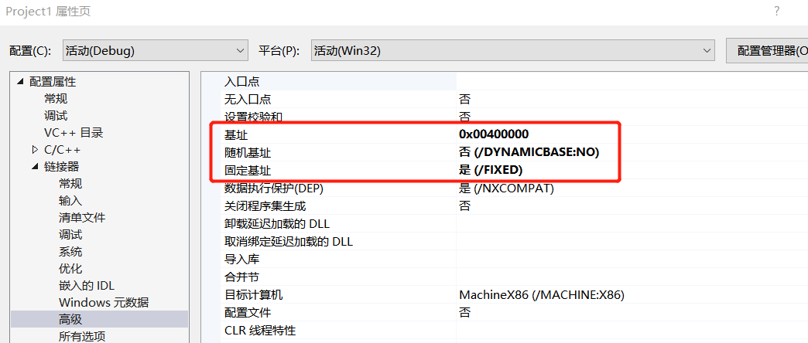      
* 同时运行，使用调试器附加到两个程序的进程并查看内存，看到结果，两个程序确实使用了相同的内存地址
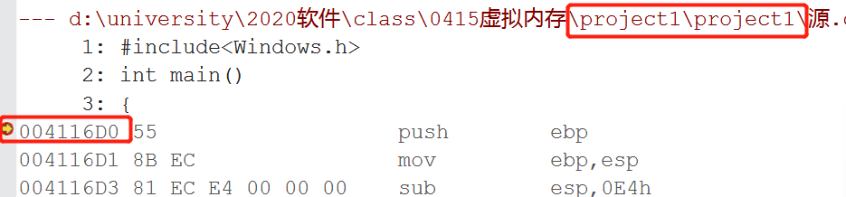      
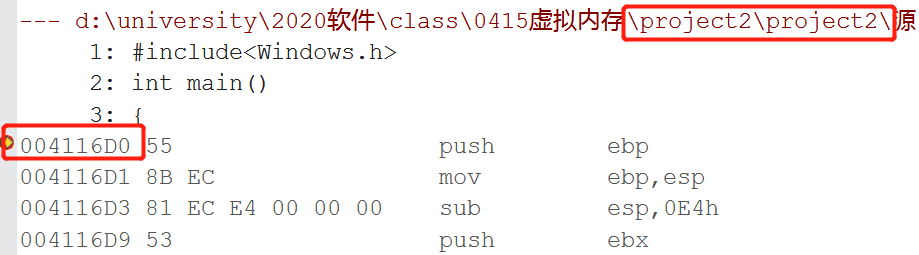      
#### 使用VirtualAlloc函数分配一块相同地址的内存 
* 在不同的进程中，尝试使用VirtualAlloc函数分配一块相同地址的内存，写入不同的数据a和b        
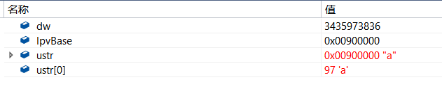      
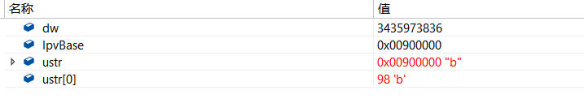     
* 进程一再读取内容
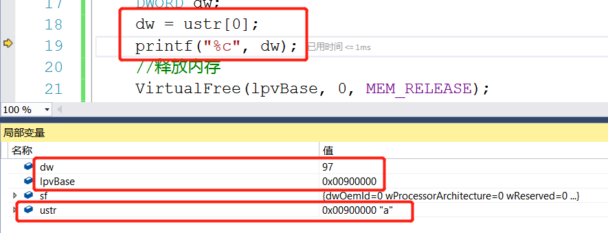      
* 验证了使用VirtualAlloc函数分配一块相同地址的内存可以保存不同的数据，同样符合的是虚拟映射的原理

### （二）配置Windbg双机内核调试环境
### *实验环境*
* 主机（Host端）：win10系统，下载安装好windbg。windbg运行在主机上，通过虚拟串口连接虚拟机。
* 虚拟机（Guest端）：xp-sp3-32位系统。运行着待调试的系统。

### 实验过程
#### 主机安装WDK
* 注意应该选择对应版本     
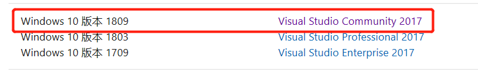      
     
#### 配置内核调试
* 关闭虚拟机的防火墙       
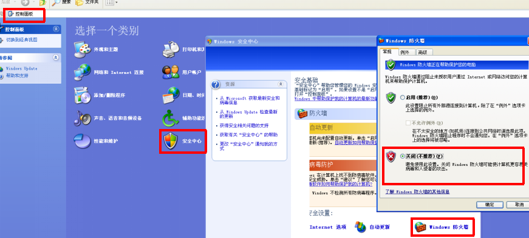     
* 设置xp虚拟机与Windbg连接的管道串口      
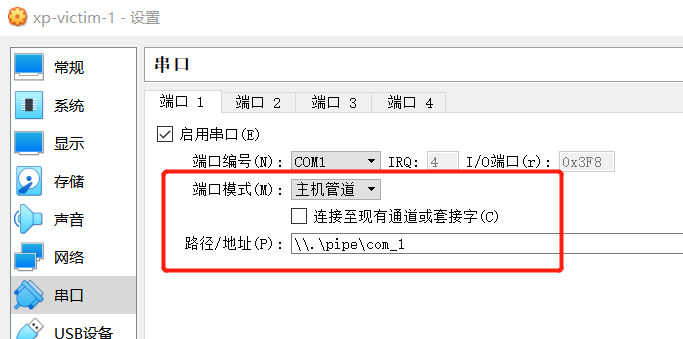     
* 修改c盘下的boot.ini文件，增加debug启动方式
```
multi(0)disk(0)rdisk(0)partition(1)\WINDOWS="Microsoft Windows XP Professional" /noexecute=optin /fastdetect /debug /debugport=com1 /baudrate=115200
```        
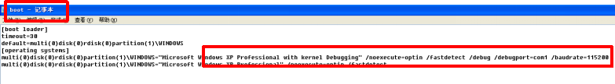     
* 其中debugport=com1为virtualbox设置的串口com1
* 配置虚拟机启动项（计算机->属性->高级）      
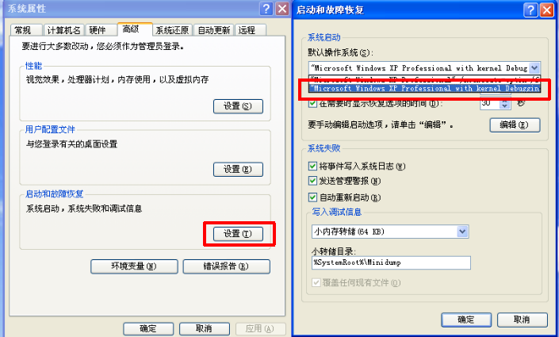     
* 重启虚拟机，选择'DebugEntry'模式开启        
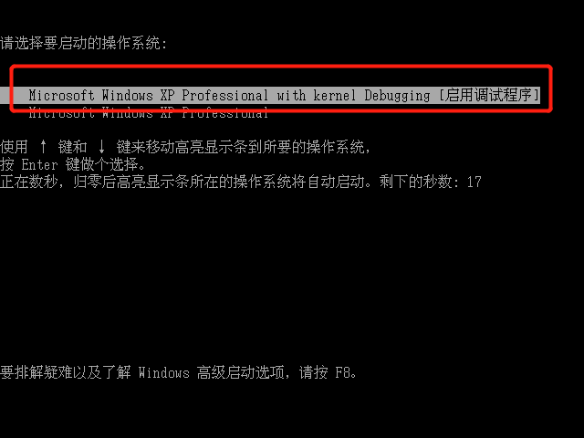     
* 对host端进行配置：进入windbg.exe所在文件夹，以下命令启动windbg：`windbg.exe -k com:port=\\.\pipe\com_1,baud=115200,pipe`     
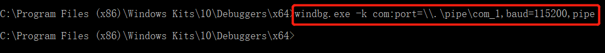     
* 连接失败提示添加符号表
* 设置添加系统环境变量_NT_SYMBOL_PATH 的值为：`srv*d:\symbols*http://msdl.microsoft.com/download/symbols`。这样启动WinDbg的时候它会自动查找这个变量，然后去相应的url地址上下载对应系统的符号文件，最后下载的符号文件保存在D:/symbols路径下
* 再次启动windbg，连接成功         
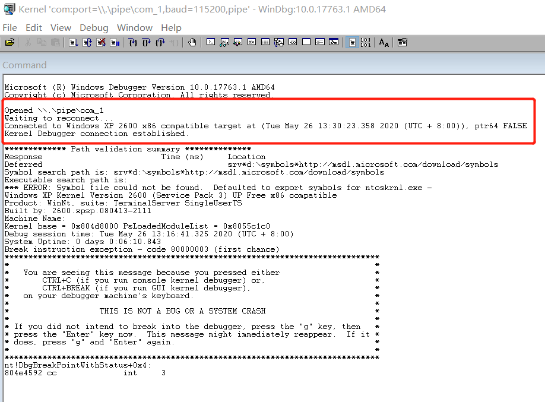     

#### 内核调试
* 虚拟地址通过pte指令，找到pfn      
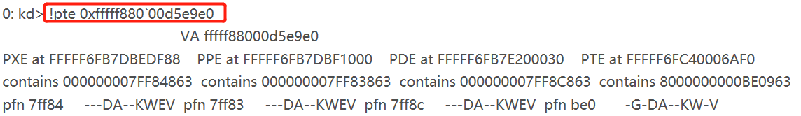     
* 找到pte对应的pfn为0xbe0，单位是4k（4096）
* 根据pfn和相对地址，找到虚拟地址对应物理地址位置。pfn为0xbe0，则物理页地址是0xbe0000（0xbe0 × 0x1000）。页内偏移为0x9e0（0xfffff880`00d5e9e0）。那么 物理地址=物理页地址+页内偏移 = 0xbe0000+0x9e0 = 0xbe09e0
* 打印物理内存       
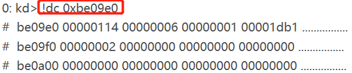     
* 打印虚拟内存          
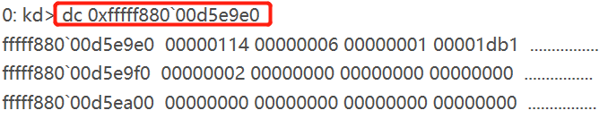     
* 发现通过虚拟地址和对应的物理地址访问内存，得到的结果是一样的


- - -
## *参考资料*
* [Windbg+VirtualBox双机调试环境配置](https://www.cnblogs.com/aliflycoris/p/5877323.html)
* [Windows 内核调试](https://zhuanlan.zhihu.com/p/47771088)
* [Windows 调试器的符号路径](https://docs.microsoft.com/zh-cn/windows-hardware/drivers/debugger/symbol-path)
