# Shellcode

## 一、实验要求
* 详细阅读 www.exploit-db.com 中的shellcode。建议找不同功能的，不同平台的 3-4个shellcode解读。
* 修改示例代码的shellcode，将其功能改为下载执行。也就是从网络中下载一个程序，然后运行下载的这个程序。提示：Windows系统中最简单的下载一个文件的API是 UrlDownlaodToFileA

## 二、实验内容
### 代码解读
```
#include <windows.h>
#include <stdio.h>

char code[] = \
"\x89\xe5\x83\xec\x20\x31\xdb\x64\x8b\x5b\x30\x8b\x5b\x0c\x8b\x5b"
"\x1c\x8b\x1b\x8b\x1b\x8b\x43\x08\x89\x45\xfc\x8b\x58\x3c\x01\xc3"
"\x8b\x5b\x78\x01\xc3\x8b\x7b\x20\x01\xc7\x89\x7d\xf8\x8b\x4b\x24"
"\x01\xc1\x89\x4d\xf4\x8b\x53\x1c\x01\xc2\x89\x55\xf0\x8b\x53\x14"
"\x89\x55\xec\xeb\x32\x31\xc0\x8b\x55\xec\x8b\x7d\xf8\x8b\x75\x18"
"\x31\xc9\xfc\x8b\x3c\x87\x03\x7d\xfc\x66\x83\xc1\x08\xf3\xa6\x74"
"\x05\x40\x39\xd0\x72\xe4\x8b\x4d\xf4\x8b\x55\xf0\x66\x8b\x04\x41"
"\x8b\x04\x82\x03\x45\xfc\xc3\xba\x78\x78\x65\x63\xc1\xea\x08\x52"
"\x68\x57\x69\x6e\x45\x89\x65\x18\xe8\xb8\xff\xff\xff\x31\xc9\x51"
"\x68\x2e\x65\x78\x65\x68\x63\x61\x6c\x63\x89\xe3\x41\x51\x53\xff"
"\xd0\x31\xc9\xb9\x01\x65\x73\x73\xc1\xe9\x08\x51\x68\x50\x72\x6f"
"\x63\x68\x45\x78\x69\x74\x89\x65\x18\xe8\x87\xff\xff\xff\x31\xd2"
"\x52\xff\xd0";

int main(int argc, char **argv)
{
  int (*func)();
  func = (int(*)()) code;
  (int)(*func)();
}
```
* 这一段代码用到了一个较为高级的C语言语法，`函数指针`。定义了一个函数指针变量，func。这个函数指针的变量类型是 int(*)()。表示返回值是int，参数列表为空的一个函数。在main函数的第二行，把全局变量 code 赋值给 func。并强制类型转换为 int(*)() 类型的函数指针。这样 func就有值了，就可以被调用了，由于func所指向的地址，就是code的地址，所有调用func的时候，运行的就是 code里面的那一堆二进制代码。
* 现在VS中建一个空工程，把###########后整个C语言部分复制到VS中。然后编译，运行。      
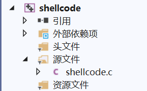      
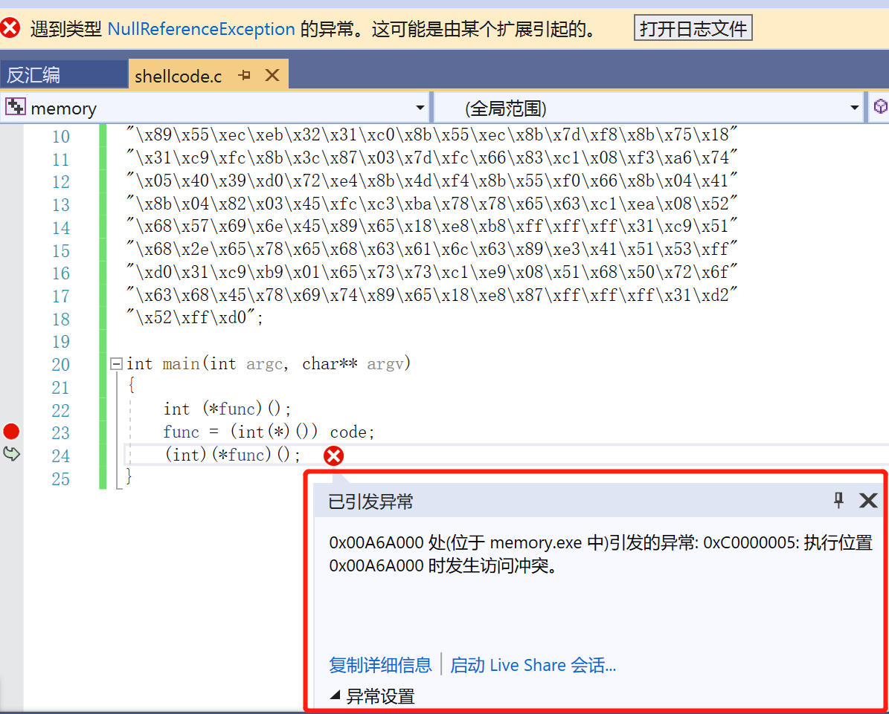      
* 报错：0xC0000005: 执行位置 0x01019000 时发生访问冲突。
* 0xC0000005 是Windows系统内部错误代码，表示内存访问异常。这个错误，表示你当前`①访问了一个未分配的内存地址`。或者，`②所访问的内存地址的保护属性冲突`。比如如果内存的保护属性是 readonly，但是你写入了，那么也会引起这个访问异常错误。
* 我们下一个断点，单步执行。发现是在运行 (int)(*func)() 时出错的。           
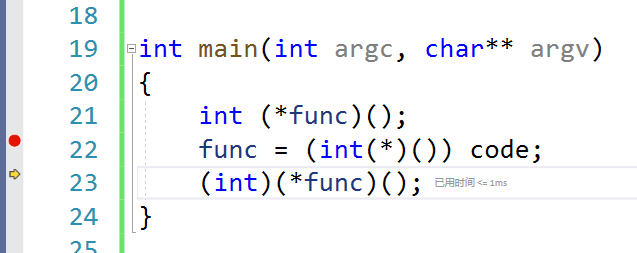      
* 这一行是调用 func执行，而现在func是指向code的，也就是func的值是code的内存地址。而code这段内存是存在的，它是一段已经分配的内存。
* 因为它是全局变量，在程序运行起来后，就存在内存中，是进程的初始化过程就完成了内存分配，并由进程初始化程序从可执行文件中直接载入内存的。`全局变量，肯定是有效地址，是可以访问的`。
* 那就应该是第二种情况，`内存分页的保护属性问题`。
* 和Linux里的文件类似，操作系统中的内存分页，也分为读写执行三种保护属性。由于code是全局变量，是数据，通常情况下，会`给数据设置可读和可写的内存保护属性`，但是`一般不会给执行属性`。但是我们要去执行它，所以可能引发了异常。
#### 验证猜想
* 调试窗口，右键转到反汇编。现在是停留在 call func这里，按F1          
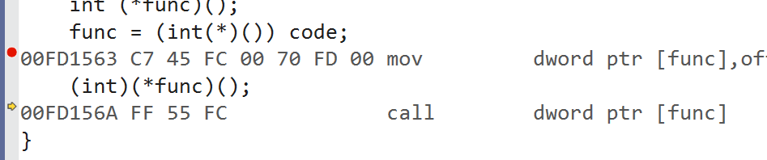      
* 按F11单步步入执行。再F11。异常出现了。          
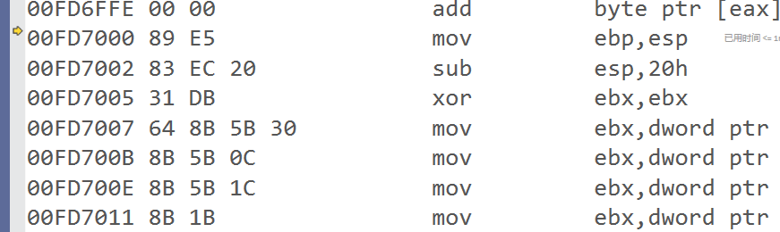      
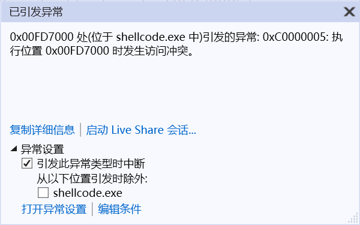      
* 这里 00FD7000 就是code的第一个字节的位置。
#### 修改错误
* 修改内存保护属性——VirtualProtect
* 修改代码
```
int main(int argc, char** argv)
{
    int (*func)();
    DWORD dwOldProtect;
    VirtualProtect(code, sizeof(code), PAGE_EXECUTE_READWRITE, &dwOldProtect);
    func = (int(*)()) code;
    (int)(*func)();
}
```             
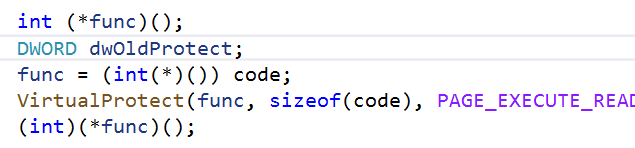      
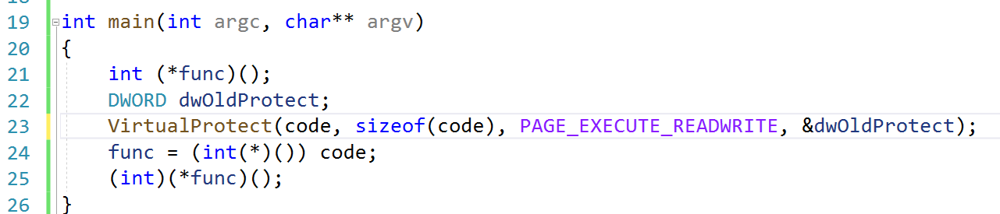      
* 代码解释
    * VirtualProtect 函数会把第一个参数，这里是 func，所指向的内存地址的 第二个参数，这里是 sizeof(code)，这段内存区域所在分页的内存属性修改为第三个参数的属性。
    * PAGE_EXECUTE_READWRITE 表示这段内存，是`可读可写可执行`。然后 通过第四个参数 dwOldProtect 反正在修改之前的内存保护属性。
* 运行了计算器程序，说明我们的shellcode运行成功了。      
      
* `解读代码`
    * 用反汇编利器。这里下个断点。        
    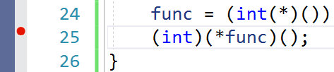      
    * 运行，断点命中后转到反汇编          
    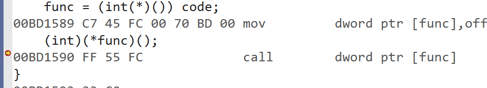      
    * F11单步步入          
    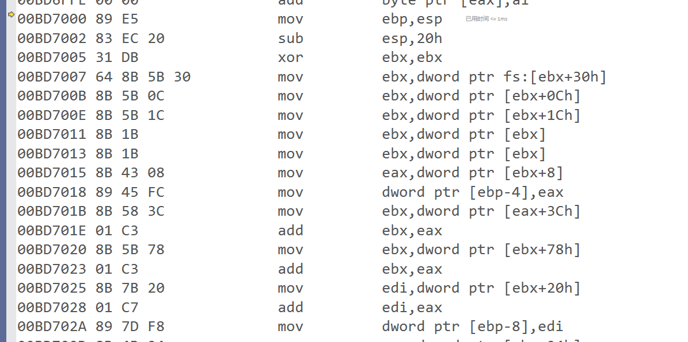      
    * 和源代码中的汇编部分，是一样的。     
    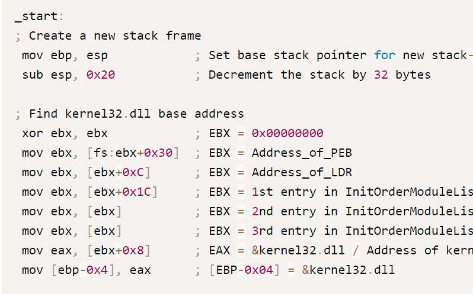      
    * 而字节码部分 89 e5 ... 是和 code一样的。     
    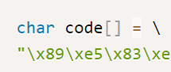      
    * code反汇编之后，就是汇编的源码。其实，这段code，就是通过前面的汇编代码，编译以后直接从汇编编译以后，从可执行文件中 dump出来的。
    * nasm 汇编器，编译为 .o文件         
    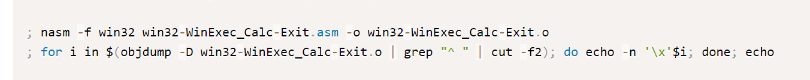      
    * 然后用objdump，能够得到code。不过由于编译器版本不一样 code可能会略有区别，但是会略有区别。
    * 把这之前的汇编代码保存为win32-WinExec_Calc-Exit.asm，然后运行两条命令。          
    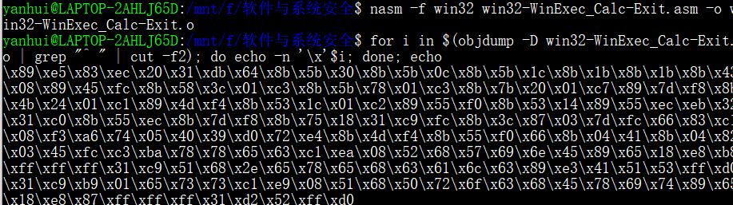      

#### 解读代码2——如何找到API的位置
* 如果我们用C语言编写一个运行计算器的程序，其实很简单。我们只需要调用一下WinExec函数，或者CreateProcess函数。
* 但我们最终要把这代code嵌入到溢出攻击的数据中，需要自己找到WinExec函数的地址，然后把函数地址放在导入表中指定的位置。
* 也就是说，shellcode，其实干了一个进程初始化的过程中，操作系统在干的事情——`API函数的动态链接`。
* GetProcAddress函数可以获得API函数的地址。但GetProcAddress函数也是一个API，地址也不知道，如果能调用GetProcAddress函数，那WinExec也能调了。所以任何API地址都没有。
* 所以早期的黑客们，想了很多办法，能不能比较原始的办法，能够获得API地址。其实操作系统，也有一个加载的过程。黑客们逆向分析了Windows系统的内部代码，分析了Windows系统内部管理进程初始化相关的数据结构。发现有一个链表，`管理了所有的已经加载的dll文件`。这个链表，就是我们这个代码里`InitOrderModuleList` 
* 这个InitOrderModuleList 在一个称为 LDR 的数据结构里。这个LDR的数据结构，又在 PEB这个数据结构里，`进程环境块`
* 而PEB数据结构，在每个进程中，是一个固定的位置，是一个绝对的常量地址。这个地址就是`fs:ebx+0x30`。从而，`地址就可以不依赖于任何API或者其他依赖，直接用汇编代码就能访问到`。从这里我们能一层层找到dll的基地址
* 然后再从dll的基地址，通过PE文件的数据结构，文件头，找到dll的导出表。
* 然后再在导出表中的数据结构中，通过函数名称的比较，得到已经在内存中的函数的地址。
* 所以代码中的循环，`findFunctionAddr` 的递归函数，和`searchLoop`就是在`遍历dll的导出表`。
* 代码中大量使用到了`硬编码的偏移地址`，比如        
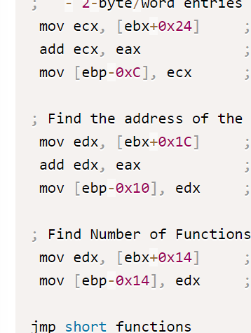     
* 就是因为上面这些说到的系统的数据结构，都是固定的结构，在每个系统中都是一样的，所以可以固定。
* 通过系统中若干数据结构这种原始的访问方式，可以找到API函数。

#### 解读代码3
* shellcode中还用到了字符串。至少函数地址的名称是需要的。还有调用WinExec的参数 calc.exe。
* 如果我们在C语言里编程，编译器会把可执行程序的代码和字符串，放在不同的地址。代码机器指令在 text段中，字符串在data段中。地址相差很远。而我们objdump，只取了代码段，没有取数据段，那要shellcode就太大了，而且中间可能会有很多的填充字符。而且数据地址很有可能是绝对地址。code一dump出来，放在了其他环境中执行，那么地址就变了。所以`字符串，code也是找不到的`。
* 实验一下，编一个程序，用到字符串，可以看看字符串的地址和代码的地址，差很远。
* 那唯一的办法，用一种什么方式，`把字符串硬编码在shellcode中`。让字符串，变为代码的一部分，内嵌在机器指令中。            
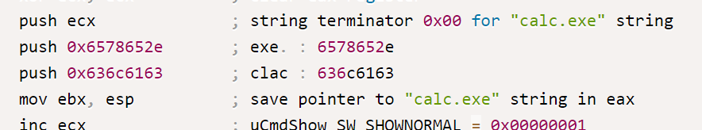     
* 这里，这儿636c6163 6578652e是 `calc.exe的big ending 反写`，压入栈以后，就形成了字符串。这样就把字符串嵌入机器指令了，作为机器指令的操作数。

### 修改示例代码的shellcode，将其功能改为下载执行
* [示例代码](https://www.exploit-db.com/exploits/48355)
* shellcode编写思路
```
获取kernel32.dll的基址
找到kernel32.dll的导出表
定位函数的入口点
使用LoadLibrary加载DLL文件
获得URLDownloadToFileA的入口地址
使用函数进行下载文件
找到WinExec函数的入口地址
调用函数运行下载的文件
最后退出程序
```
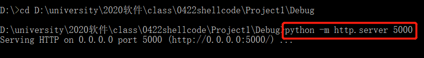    
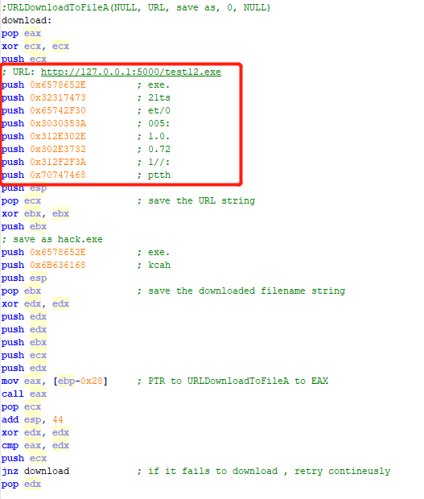     
* 编译链接[shellcode.asm](code/shellcode.asm)，使其成为为可执行代码
* shellcode.exe转成十六进制，vs中使用.c文件运行shellcode 
* 代码执行成功以后，同一路径下可以看到.exe文件被下载
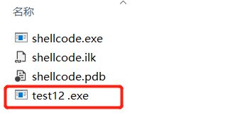     

- - -
## *参考资料*
* [shellcodes](https://www.exploit-db.com/shellcodes)
* [Windows/x86 - Null-Free WinExec Calc.exe Shellcode](https://www.exploit-db.com/shellcodes/48116)
* [URLDownloadToFile function](https://docs.microsoft.com/en-us/previous-versions/windows/internet-explorer/ie-developer/platform-apis/ms775123(v%3Dvs.85))
* [Windows/x86 - URLDownloadToFileA Shellcode](https://www.exploit-db.com/shellcodes/40094)
* [PEB结构学习](https://www.cnblogs.com/binlmmhc/p/6501545.html)