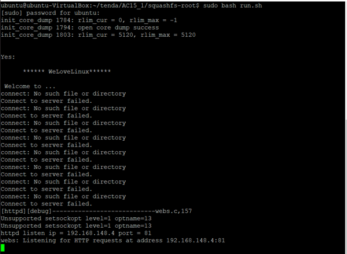
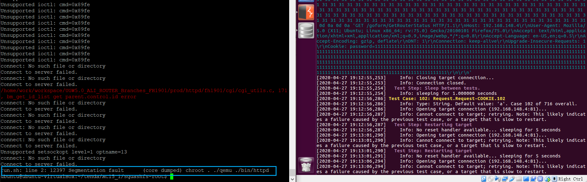
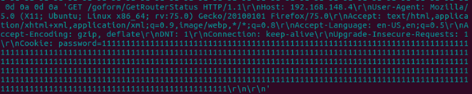

# Fuzzing

## 一、实验要求
* 搜集市面上主要的路由器厂家、在厂家的官网中寻找可下载的固件在CVE漏洞数据中查找主要的家用路由器厂家的已经公开的漏洞，选择一两个能下载到切有已经公开漏洞的固件。
* 如果能下载对应版本的固件，在QEMU中模拟运行。确定攻击面（对哪个端口那个协议进行Fuzzing测试），尽可能多的抓取攻击面正常的数据包（wireshark）。
* 查阅BooFuzz的文档，编写这对这个攻击面，这个协议的脚本，进行Fuzzing。配置BooFuzz QEMU的崩溃异常检测，争取触发一次固件崩溃，获得崩溃相关的输入测试样本和日志。尝试使用调试器和IDA-pro监视目标程序的崩溃过程，分析原理。

## 二、实验准备
## Fuzzing模糊测试
* Fuzzing是目前漏洞挖掘的主要方法之一，是各种漏洞挖掘技术中人力消耗比较低，技术门槛比较低，同时效果却比较好的一种方法。其他的方法，比如程序分析、符号执行等也人在用。但是难度相对较大一些。
### 如何使用Fuzzing来进行挖掘漏洞
* 1.首先确定一个目标：对什么软件进行漏洞挖掘，软件是做什么的，数据来源是文件还是网络，或者既有文件又有网络。
    * 因为Fuzzing的主要原理就是随机性地大量给被测试软件输入数据，所以首先需要知道软件是处理什么样的数据的，应该如何给软件输入数据。
    * 一般来讲，现在`数据来源主要是文件和网络两种`。如果是文件型的，最典型的比如Word，那么我们就需要构造大量的文件。如果是网络的，比如一个Web服务器，那么我们就需要构造大量的网络数据包发送给被测试软件。我们一般称为`文件型Fuzzing`和`网络型Fuzzing`
* 2.选定了被测试软件以后，需要构造软件的运行环境。
    * 如果是Windows Linux的应用软件，可以直接运行。如果是手机软件，由于手机自带的调试功能比较弱，不方便控制和输入，一般可能需要一个模拟器来运行。
* 3.有了运行环境以后，下一步，需要选择一个Fuzzing的框架。
    * Fuzzing技术发展了很多年，有很多人已经开发了不少框架。框架已经解决了Fuzzing测试中的一些基本的共性的问题，我们不需要重头开始做。在框架的基础上，我们只需要进行一些配置或者少量的编程就可以开始进行测试了。
* 4.然后，我们需要选择一种策略。比如是基于生成的还是基于变异的。
    * `基于生成`：指数据完全是重新构造的，不是基于一些已有的数据或者模板。当然重新构造的过程中，也不能完全瞎构造，通常有效的测试数据并不是完全畸形的数据，而是半畸形数据。因为完全畸形的数据，可能在到达测试对象之前就已经被丢弃了。比如一个网络数据包，如果不符合数据包的基本格式。连IP地址都不对。那肯定是到不了被测试对象的。所以基于生成的，也需要`在规则、协议、文件格式的基础上进行`。所以基于生成的策略，一般只对协议已知、格式开放的目标。
    * `基于变异`：指在已有的合法数据基础上，通过一定的随机性的变化来得到测试数据。一些`位置协议或者格式不清楚的数据`，就可以采用基于变异的策略。已有的合法数据比较容易得到，比如很多年前，Word没有开放doc文件的格式。如果我们要对Word进行Fuzzing，就应该采取基于变异的策略。用Word先保存生产一个合法的doc文件，再在这个合法的doc文件的基础上大量变异，也就是随机性的替换一些数据、插入删除一些片段数据来得到大量的测试数据。
    * 同样，如果是对网络程序进行Fuzzing，我们可以`让网络程序先正常运行，抓取数据包。然后对抓取的数据包进行重放，重放过程中进行一定比例的变异`（随机性的替换、插入、删除）。

## 实例说明——家用路由器
### 如何对家用路由器采用Fuzzing技术进行漏洞挖掘
* 1.首先，需要了解到，这种路由器，其实是硬件和软件一体的一个小型的设备。
    * 它的架构和我们的电脑、手机其实有相同的地方。它也有CPU、内部有操作系统、在操作系统中还有少量的应用软件，来实现路由器的一些功能。
    * 不同的是，这种小型路由器一般是`MIPS架构的CPU`，我们的电脑一般是intel架构的CPU(x86 x64)，Intel架构的CPU既包括Intel生成的CPU也包括AMD公司生产的CPU。我们的手机都是ARM架构的CPU。
    * 这几种架构各有特点。`MIPS适合小型化设备，功耗低性能弱、价格便宜，结构简单`。ARM适合中型一些的设备，体积小能耗小功能适合手机，但是价格比较高。x86_64适合电脑和服务器，能耗高（发热也就高）、性能最高，价格最贵，结构最复杂。当然这几种CPU架构，他们的指令集是不一样的，所以`有各自的汇编语言`，也有各自的编译器工具链。
    * 手机操作系统并不能运行在PC上。同样这种路由器的操作系统，也无法直接运行在PC上。所以前期有一些`环境搭建的工作`，需要把路由器的系统运行在模拟器中。
    * `QEMU`是这种场景下广泛使用的模拟器。
* 如果进行家用路由器的漏洞挖掘，可能需要安装 QEMU
    * [下载地址](https://www.qemu.org/)
    * ubuntu下，一个成功的QEMU安装实例：
```
apt-get install zlib1g-dev
apt-get install libglib2.0-0
apt-get install libglib2.0-dev
apt-get install libtool
apt-get install libsdll.2-dev
apt-get install libpixman-1-dev
apt-get install autoconf
apt-get install qemu
apt-get install qemu-user-static
apt-get install qemu-system
```
* QEMU的基本原理是模拟各种CPU的执行环境，用软件来实现CPU的硬件功能并封闭出来执行的环境。
* 使用QEMU可以跨平台运行系统和软件。在软件开发和调试中应用非常广泛。比如我们开发手机APP，安卓系统的调试模拟环境就是基于QEMU的。
* 2.执行环境有了，第二步，我们需要把我的目标程序在执行环境中运行。
    * 路由器的操作系统和整个应用软件，是植入到路由器的存储器中的。就像我们的PC中的系统和软件安装在硬盘上一样。由于路由器功能单一，系统不大，所以一般将操作系统和应用程序打包成一个镜像文件，称为`固件（Firmware）`。
    * 如果有了固件，就可以在模拟器中运行整个路由器了。所以路由器这种东西也是分为硬件和软件的，`其bug和漏洞也主要是出现在软件中`，硬件中的问题，我们一般不考虑。`软件都位于固件中`。
    * 固件的主体是一个`裁剪过的微型Linux系统`。然后在这个系统至少运行一些实现路由器功能的应用程序。比如会有实现路由协议的实现包转发的程序、有实现用户配置的程序（一般是一个Web服务器）、有实现内网地址分发的DHCP的程序等。
    * 要得到固件，有两种办法。`一种是直接从路由器中提取。一种是从官方网站上下载一个固件`。路由器中当然是有固件的，否则它不能运行。厂家的官方网站有时候会开放固件供下载，因为有一些用户有升级固件的需求，比如上一个版本的固件中发现了bug，厂家就会在网站上发布一个新的固件，让用户在配置界面中升级。虽然对大多数用户不会去升级路由器的固件。但是负责任的厂家有更新的义务。不过既然绝大部分不更新，也不会更新，所以也有一些厂家不提供。那么如果是`有固件的，我们可以直接下载，没有的，就需要提取`。提取固件，也有现成的工具，比如binwalk。
    * 这是使用binwalk工具提取了一款tenda路由器的固件。
    *    
    * 提取以后的固件使用QEMU加载运行
    * 使用`qemu-arm-static`运行提取的固件
    *    
    * 可以看到，路由器中用于用户配置的Web服务器已经运行起来了。这种小型设备一般使用httpd这种小型的静态的http server.
### 如何对已经运行起来的目标系统进行Fuzzing测试
*    
* 这个图比较清楚的说明了搭建一个针对这种小型路由的漏洞挖掘工作环境的流程。
* 有一些下载的固件或者固件内部的部分软件是源代码形式的。所以可能还需要编译一下。这里的编译和我们之前用过的编译不同，称为`交叉编译`。我们以前在一个x86架构下的PC中，编译一个本架构下的软件，编译后在本机运行。而`交叉编译是编译一个在其他系统中运行的软件`，比如在x86系统中编译一个MIPS架构的软件。
* 由于MIPS架构的主机一般性能不高，软件环境单一，所以通常不作为工作环境，也跑不起来编译器。所以我们在PC上进行编译发布在响应环境中运行。
* mips-gcc 和 mipsel-gcc 编译器就是`交叉编译器`。
* 在实验过程中，根据情况，可能还有其他的支撑工具需要使用。
* 3.搭建好环境以后，系统和应用已经运行起来。下一步，就可以使用Fuzzing测试工具进行测试了。
    * Fuzzing已经有一些框架可以使用：SPIKE、AFL、Sulley、BooFuzz
```
AFL（American Fuzzy Lop）是由安全研究员Michał Zalewski开发的一款基于覆盖引导（Coverage-guided）的模糊测试工具，它通过记录输入样本的代码覆盖率，从而调整输入样本以提高覆盖率，增加发现漏洞的概率。其工作流程大致如下：
1)   从源码编译程序时进行插桩，以记录代码覆盖率（Code Coverage）；
2)   选择一些输入文件，作为初始测试集加入输入队列（queue）；
3)   将队列中的文件按一定的策略进行“突变”；
4)   如果经过变异文件更新了覆盖范围，则将其保留添加到队列中;
5)   上述过程会一直循环进行，期间触发了crash的文件会被记录下来。
```
   
* 可以看出AFL是基于变异策略的。
* 所以的Fuzzing测试，有一个目标就是`通过输入畸形数据让程序崩溃crash`，程序的崩溃往往就意味着有bug或者有漏洞。然后对引起崩溃的输入样本，或者崩溃或的系统日志、dump文件等进行分析。
* AFL用了一种称为插桩的技术来进行崩溃的检测。
```
SPIKE是由Dave Aitel编写的一款非常著名的Protocol Fuzz（针对网络协议的模糊测试）工具，完全开源免费。它提供一系列API用于用户使用C语言创建自己的网络协议模糊测试器。SPIKE定义了许多可用于C编码器的原语，这些原语允许其构造可以发送给网络服务的模糊消息以测试是否产生错误。SPIKE功能如下：
第一，含大量可用于处理程序中产生错误的字符串。并且，SPIKE能够确定哪些值最适合发送到应用程序，从而以一种有用的方式导致应用程序异常。
第二，SPIKE引入“块”的概念，用于计算由SPKIE代码生成的数据内指定部分的大小，并且可以将这些值以各种不同的格式插入。
第三，支持并以不同格式接收许多在网络协议中常用的不同数据类型。
SPIKE功能强大，是一款优秀的模糊测试工具，但是文档较少，只能根据各种参考资料和一些测试脚本整理常用的API使用方法。
```
```
Sulley是由Pedram Amini编写的一款灵活且强大的模糊测试工具。可用于模糊化文件格式、网络协议、命令行参数和其它代码。除了专注于数据生成外，Sulley还具有如下功能：
第一，监视网络并保留记录。
第二，检测和监控目标程序的健康状况，能够使用多种方法恢复到已知的良好状态。
第三，检测、跟踪和分类检测到的故障。
第四，可以并行执行测试，提高检测速度。
第五，自动确定测试用例触发的特殊错误。
Sulley功能比SPIKE更加的完善，能够进行构造模糊测试数据、监测网络流量、进行错误检测等，但是Sulley检测只能用于x86平台。
```
```
Boofuzz是Sulley的继承与完善。Boofuzz框架主要包括四个部分：
第一，数据生成，根据协议原语构造请求。
第二，会话管理或驱动，将请求以图的形式链接起来形成会话，同时管理待测目标、代理、请求，还提供一个Web界面用于监视和控制检测、跟踪并可以分类检测到的故障。
第三，通过代理与目标进行交互以实现日志记录、对网络流量进行监控功能等。
第四，有独立的命令行工具，可以完成一些其他的功能。
```
* 可以看出，以上几种主要的模糊测试工具中，BooFuzz是比较适合的一种。
#### 安装和配置BooFuzz
* 使用Boofuzz对模拟器环境中的路由器程序进行测试主要步骤为：
    * 第一，根据网络请求数据包构造测试用例请求；
    * 第二，设置会话信息(目标IP、端口号等)，然后按照请求的先后顺序将其链接起来；
    * 第三，添加对目标设备的监控和重启机制等；
    * 第四，开始测试。
* 以上述tenda路由器为例，在运行起来以后，如果我们对其http服务进行Fuzzing，我们可以使用浏览器先访问他们的http 服务。
* 这是路由器固件在QEMU中运行以后的结果，可以看到 服务器监听在 192.168.148.4:81。通过浏览器访问192.168.148.4:81与路由器管理界面进行尽可能多的交互，使用Wireshark抓取到不同URI的数据包。
   
* 对捕获的数据包进行分析，确定数据输入点
```
#以抓取到的其中一个数据包为例：
1   GET /goform/GetRouterStatus?0.7219206793806395&_=1587978102556  HTTP/1.1
2   Host: 192.168.148.4:81
3   User-Agent: Mozilla/5.0 (X11; Ubuntu; Linux x86_64; rv:75.0) Gecko/20100101 Firefox/75.0
4   Accept: text/plain, */*; q=0.01
5   Accept-Language: en-US,en;q=0.5
6   Accept-Encoding: gzip, deflate
7   X-Requested-With: XMLHttpRequest
8   DNT: 1
9   Connection: keep-alive
10  Cookie:password=""
11  Referer: http://192.168.148.4:81/main.html
```
* 根据HTTP协议特点及缓冲区溢出漏洞特点，对该请求选取以下数据输入点
第1行，HTTP协议有GET、POST、PUT、DELETE、CONNECT、OPTIONS、TRACE等方法，若方法使用错误可能会超长缓冲区溢出漏洞，例如，相比GET方法，POST方法可以提交更多的数据，若使用POST方法提交的表单误用了GET方法进行提交，会导致查询字符串过长造成溢出，因此`把数据包中的GET方法当成一个输入点`。若URI超长，服务器在处理请求的时候使用危险函数读取URI或未对URI长度进行限制，也可能导致安全漏洞，因此`将URI处也进行模糊测试`。第10行，若Cookie超长，程序认证用户身份信息时若用危险函数读取Cookie也可能造成缓冲区溢出，因此`将Cookie处进行模糊测试`。
* 选定了一个具体目标，就可编写模糊测试脚本了。根据上述分析，利用Boofuzz提供的原语对HTTP请求进行定义，设置与会话相关的信息，包括目标设备IP地址、端口等。（脚本的编写，需要查一下BooFuzz的官方文档，查看示例代码，比较容易）
* 在进行测试的是否发现了程序崩溃异常的一个测试数据。在模拟器中监视到了程序崩溃。造成程序异常的数据包主要是其Cookie字段过长，初步判断是由于Cookie字段造成缓冲区溢出导致程序异常退出。
   
   
* 有了以上数据以后，就可以将引起崩溃的输入数据在调试环境下再次输入到测试对象，进行调试了。
* 下图是上面那个漏洞的相关代码，在IDA-pro调试后定位的漏洞代码。
   
* 图中的if语句不满足，函数不会读取R3寄存器存储地址，而是直接返回，因此，若在测试数据中添加.gif，则PC寄存器将会被覆盖。
* 这些事后的分析是经过了非常多的调试工作以后确定的。工具主要是GDB和IDA-pro      

   
* 上图显示了使用binwalk QEMU BooFuzz GDB IDA-pro一系列工具，发现了路由器http管理界面由于cookie超长引起的一个缓冲区溢出漏洞的发现（复现）过程。


## 三、实验过程
### 下载固件并提取
* 漏洞：CVE-2017-17215
* 安装binwalk
```
cd firmware-analysis-toolkits
sudo git clone https://github.com/devttys0/binwalk.git
cd binwalk 
sudo ./deps.sh
sudo python3 ./setup install
sudo -H pip3 install git+https://github.com/ahupp/python-magic
sudo -H pip install git+https://github.com/sviehb/jefferson
```
* 提取固件
```
binwalk -Me HG532eV100R001C02B017_upgrade_main.bin
```

### 模拟运行固件
* 安装qemu
* [ubuntu 16.04 LTS-binwalk-manual](http://manpages.ubuntu.com/manpages/xenial/en/man1/binwalk.1.html)
```
sudo apt-get install qemu 
sudo apt-get install qemu-user-static
sudo apt-get install qemu-system
```
* 安装网络配置工具
```
apt-get install bridge-utils uml-utilities
```
* 修改 ubuntu主机网络配置，修改ubuntu主机系统中的网络接口配置文件 /etc/network/interfaces         
      
* 创建QEMU的网络接口启动脚本（/etc/qemu-ifup）      
      
```
# 赋予文件/etc/qemu-ifup 可执行权限
sudo chmod a+x /etc/qemu-ifup 

# 重启网络使所有的配置生效
sudo /etc/init.d/networking restart

# 关闭ens33，启动桥连网络br0
sudo ifdown eth0  
sudo ifup br0

# 启动qemu运行刚镜像
sudo qemu-system-mips -M malta -kernel vmlinux-2.6.32-5-4kc-malta -hda debian_squeeze_mips_standard.qcow2 -append "root=/dev/sda1 console=tty0" -net nic,macaddr=00:16:3e:00:00:01 -net tap

```
* 用root/root登录qemu虚拟机           
      
* 在ubuntu上利用ssh连接虚拟机
* 将之前解压的固件包拷贝到虚拟机里面：
`scp -r ./squashfs-root  root@ip:/root/`
完成搭建路由器固件运行的环境

- - -
## *参考资料*

* [路由器固件模拟环境搭建](https://blog.csdn.net/wuyou1995/article/details/105545581/)
* [通过CVE-2017-17215学习路由器漏洞分析](https://blog.csdn.net/weixin_30394981/article/details/94955702)

