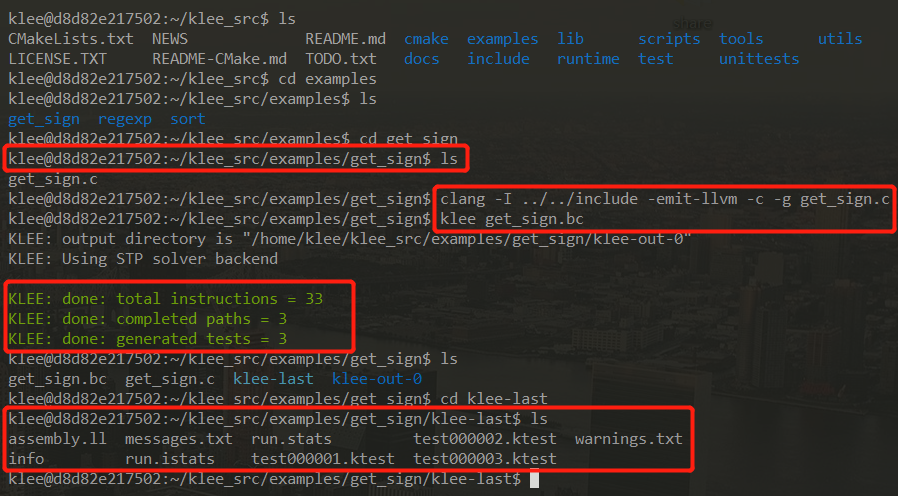
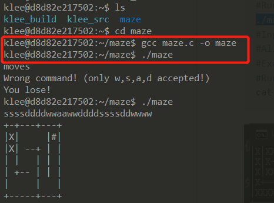

# KLEE

## 一、实验要求
* 安装KLEE，完成官方tutorials


## 二、实验准备
### 实验环境
* vmware + ubuntu16.04 server
### 符号执行过程
* `根据代码生成符号执行树->收集路径的约束->转为SMT-LIB格式->输入给约束求解器->验证路径可达或者不可达，可达的情况下获得解->根据解自动构造输入数据`
* 但是不同的符号执行工具在实现时有不同，比如KLEE，只能分析C源码程序。后续的一些工具可以分析二进制程序。
### KLEE
* klee是通过对llvm bitcode进行解释以实现符号执行的工具。它通过插入函数调用（klee_make_symbolic）对内存进行符号化。并且会跟踪符号内存的使用，并收集使用这些符号内存的约束。如果有使用前面符号内存的其他内存，那么该内存也将会被符号化。当遇到一个使用符号化内存的分支时，KLEE会将执行状态一分为二，看看分支的哪一边可以找到一个可以满足符号约束的解。KLEE使用STP来求解这些符号约束。
* https://klee.github.io/
* KLEE能实现全自动化，唯一的缺点是需要在程序中进行少量的修改。     
    
* 这个 `klee_make_symbolic(&a, sizeof(a), "a");`的作用就是a标记为需要求解的输入数据。
*  BitBlaze还有一些后续工具，能够实现输入数据的自动识别，更高级一些。
### 使用KLEE的步骤
* 准备一份源码
* 标记要分析的输入数据，编译
* 使用KLEE来运行编译后的程序
* 得到KLEE自动生成的测试用例
* 最后把所有输入测试用例循环输入给被测试程序，完成自动测试。


## 三、实验过程
### 安装KLEE
* ssh 连接虚拟机
```
#判断是否安装ssh服务，可以通过如下命令进行：
$ ps -e|grep ssh

#如果没有sshd则说明没有安装ssh
#安装ssh
$ apt-get install openssh-client
$ apt-get install openssh-server

#安装完成以后，先启动服务
$ /etc/init.d/ssh start
# 启动后，查看是否正确启动
$ ps -e|grep ssh

#安装成功之后，需要更改sshd_config文件
$ vim /etc/ssh/sshd_config
#修改这一句
PermitRootLogin yes

#然后重启ssh服务:
$ /etc/init.d/ssh restart
#window上连接
ssh 帐号@IP地址
```
* 虚拟机不能联网
```
$ sudo vim /etc/resolv.conf
#在里面填入DNS
nameserver 8.8.8.8
nameserver 8.8.4.4
#保存关闭后，重启网络即可
$ sudo /etc/init.d/networking restart 
```

* 安装docker
```
#更新apt包索引：
$ sudo apt-get update
#安装以下包以使apt可以通过HTTPS使用存储库（repository）：
$ sudo apt-get install -y apt-transport-https ca-certificates curl software-properties-common
#添加Docker官方的GPG密钥：
$ curl -fsSL https://download.docker.com/linux/ubuntu/gpg | sudo apt-key add -
#使用下面的命令来设置stable存储库：
$ sudo add-apt-repository "deb [arch=amd64] https://download.docker.com/linux/ubuntu $(lsb_release -cs) stable"
#再更新一下apt包索引：
$ sudo apt-get update
#安装最新版本的Docker CE
$ sudo apt-get install -y docker-ce
```
* 验证docker安装成功
```
#查看docker服务是否启动：
$ systemctl status docker
#若未启动，则启动docker服务：
$ sudo systemctl start docker
```
    
* 在docker中安装klee
```
# 启动 docker
systemctl start docker
# 安装 KLEE
docker pull klee/klee:2.0

# 创建一个临时容器(为了测试实验用)
docker run --rm -ti --ulimit='stack=-1:-1' klee/klee:2.0

# 创建一个长期容器
sudo docker run -ti --name=klee_cjx --ulimit='stack=-1:-1' klee/klee
# 退出后可通过名字再次进入
sudo docker start -ai klee_cjx
# 删除长期容器
docker rm klee_container
```
    
    

## [Tutorial One](http://klee.github.io/tutorials/testing-function/): Testing a small function.
* 转到.c文件所在的目录下`~/klee_src/examples/get_sign`
```
//这是一个判断正负数的程序
#include <klee/klee.h>

int get_sign(int x) {
  if (x == 0)
     return 0;
  
  if (x < 0)
     return -1;
  else 
     return 1;
} 

int main() {
  int a;
  klee_make_symbolic(&a, sizeof(a), "a");
  //klee_make_symbolic：KLEE工具自带的测试函数，通过自定义的变量，不断产生值赋给a，以此完成自动生成样例功能
  return get_sign(a);
} 
```
* 编译该文件
`clang -I ../../include -emit-llvm -c -g get_sign.c`
* 运行klee
`klee get_sign.bc`
* 结果如下，KLEE给出了总指令数，完整路径和生成的测试案例数      
    
* klee-out-0是本次测试结果，klee-last是最新测试结果，每次测试后覆盖

## [Tutorial Two](http://klee.github.io/tutorials/testing-regex/): Testing a simple regular expression library.
* 这个例子中的错误不是由于正则表达式函数的错误，而是我们测试驱动程序的错误。由于我们的符号变量re是一个字符数组，但是match函数期望它是一个以null终止的字符串，所以会报错
```
#include <klee/klee.h>
static int matchhere(char*,char*);
static int matchstar(int c, char *re, char *text) {
  do {
    if (matchhere(re, text))
      return 1;
  } while (*text != '\0' && (*text++ == c || c== '.'));
  return 0;
}

static int matchhere(char *re, char *text) {
  if (re[0] == '\0')
     return 0;
  if (re[1] == '*')
    return matchstar(re[0], re+2, text);
  if (re[0] == '$' && re[1]=='\0')
    return *text == '\0';
  if (*text!='\0' && (re[0]=='.' || re[0]==*text))
    return matchhere(re+1, text+1);
  return 0;
}

int match(char *re, char *text) {
  if (re[0] == '^')
    return matchhere(re+1, text);
  do {
    if (matchhere(re, text))
      return 1;
  } while (*text++ != '\0');
  return 0;
}

/*
 * Harness for testing with KLEE.
 */

// The size of the buffer to test with.
#define SIZE 7

int main() {
  // The input regular expression.
  char re[SIZE];
  
  // Make the input symbolic. 
  klee_make_symbolic(re, sizeof re, "re");

  // Try to match against a constant string "hello".
  match(re, "hello");

  return 0;
}
```
* KLEE运行测试后报错，说明出现内存错误，指针超出了预定范围      
    
* 解决此问题的最简单方法是在将符号设为符号后，将'\ 0'存储在缓冲区的末尾
```
int main() {
  // The input regular expression.
  char re[SIZE];

  // Make the input symbolic.
  klee_make_symbolic(re, sizeof re, "re");
  re[SIZE - 1] = '\0';

  // Try to match against a constant string "hello".
  match(re, "hello");

  return 0;
}
```
## [Tutorial Three](pic/klee-maze.pdf):Solving a maze with KLEE
* 这是一个11*7的迷宫问题，程序中故意在迷宫的第二行开了一个后门。KLEE通过符号执行找到了所有的解（包括陷阱）。通过这个例子可以完全看到KLEE符号执行的过程，首先是按照符号变量的size每一个字节都是符号值，然后从第一个字节开始一个一个地试验具体值（本例中实验的顺序w->a->d->s,且这4个都会试个遍，然后保存所有可行的具体值，再次基础上在再试验第二个字节，如此下去，知道实验完所有的字节，也就找到了所有的可行路径。）
* 下载迷宫的程序
```
# Update aptitude 
sudo apt-get update
# Install git 
sudo apt-get install -y git-core
# Download maze 
git clone https://github.com/grese/klee-maze.git ~/maze


# Build & Run Maze
# Source is in maze.c.
cd ~/maze

#Build: 
gcc maze.c -o maze
#Run manually: 
./maze
#Input a string of "moves" and press "enter"
#Allowed moves: w (up), d (right), s (down), a (left)
```
    

* 通过修改源代码，把用户输入改为符号测试，看到所有的测试用例,将read调用改成klee_make_symbolic，在printf ("You win!\n");这个语句之后增加一个klee_assert(0);，这样每次成功就会又一次assert
```
#include <klee/klee.h>
#include <stdlib.h>
#include <stdio.h>
#include <unistd.h>

#define H 7
#define W 11
#define ITERS 28

char maze[H][W] = {
    "+-+---+---+",
    "| |     |#|",
    "| | --+ | |",
    "| |   | | |",
    "| +-- | | |",
    "|     |   |",
    "+-----+---+"
};

void draw ()
{
    int i, j;
    for (i = 0; i < H; i++)
    {
        for (j = 0; j < W; j++)
        {
            printf("%c", maze[i][j]);
        }
        printf("\n");
    }
    printf("\n");
}

int main (int argc, char *argv[])
{
    int x = 1, y = 1;    //Player position
    int ox, oy;          //Old player position
    int i = 0;           //Iteration number
    char program[ITERS];

    maze[y][x] = 'X';

    // Use Klee's symbolic execution
    klee_make_symbolic(program, ITERS, "program");

    while(i < ITERS)
    {
        //Save old player position
        ox = x;
        oy = y;

        switch (program[i])
        {
        case 'w':
            y--;
            break;
        case 's':
            y++;
            break;
        case 'a':
            x--;
            break;
        case 'd':
            x++;
            break;
        default:
            printf("Wrong command! (only w,s,a,d accepted!)\n");
            printf("You lose!\n");
            exit(-1);
        }

        if (maze[y][x] == '#')
        {
            printf("You win!\n");
            printf("Your solution %s\n", program);
            klee_assert(0); // Klee assertion identifies the win
            exit(1);
        }

        if (maze[y][x] != ' ' && !((y == 2 && maze[y][x] == '|' && x > 0 && x < W)))
        {
            x = ox;
            y = oy;
        }

        if (ox==x && oy==y)
        {
            printf("You lose\n");
            exit(-2);
        }

        maze[y][x]='X';
        draw();    //draw it

        i++;
        sleep(1);    //wait for next input
    }

    printf("You lose\n");
}
```
* 对修改后的源文件进行编译测试，可以得到所有成功以及失败的例子，并在show_solutions.sh中看到成功的例子
```
#Build LLVM Bytecode: 
./scripts/build_bc.sh #(builds "maze_klee.bc" using "clang -emit-llvm")
#Ignore the "implicit declaration of function '__assert_fail'" warning.
#Run Klee on Bytecode: 
./scripts/run_klee.sh #(runs klee on "maze_klee.bc" using "--emit-all-errors")
#Show solutions: 
./scripts/show_solutions.sh #(gets klee test results from "ktest-tool", and prints maze solutions)
```     
    


- - -
## *参考资料*
* [ubuntu16.04下安装docker](https://www.cnblogs.com/jiyang2008/p/9014960.html)
* [KLEE入门教程](https://blog.csdn.net/qq_26736193/article/details/103455451)
* [klee-maze](https://github.com/grese/klee-maze)