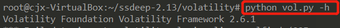
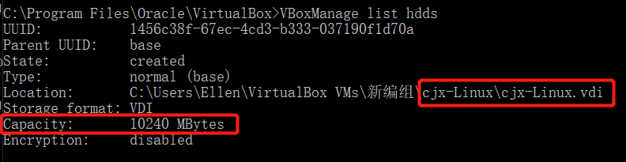

# 恶意软件防御体系

## 一、实验要求
* 安装并使用[cuckoo](https://cuckoosandbox.org/)
* 任意找一个程序，在cuckoo中trace获取软件行为的基本数据


## 二、实验准备
### 实验环境
* ubuntu18.04
    * 网卡配置：NAT 与 HOST ONLY
* windows xp
### cuckoo
* 现在的软件安全防御体系中一个非常重要的点，程序行为分析的相关原理和技术。
* 对疑似恶意软件的分析，要在一个`隔离环境`中进行。
    * 对恶意软件进行隔离是因为恶意软件有可能对去环境进行破坏。
    * 所以安全研究人员们，开发了一种专门的既可以隔离恶意软件（使其恶意行为之限定在虚拟机内部，不会对其他环境造成而已的破坏）同时又可以追踪分析软件行为的的工具，就是`沙箱`。目前应用得最广泛的沙箱是 cuckoo。
* cuckoo在部署阶段，在Guest系统里塞了一个agent，这个agent在运行阶段负责与Host端程序进行通信，从Host端接收sample, 整个客户端程序，以及配置文件。Cuckoo 的架构比较简单，在 Host 机上运行 Cuckoo 主程序，多个 Guest 机通过虚拟网络与 Host 机相连


## 三、实验过程
### ubuntu环境搭建
```
#更新
sudo apt-get update
sudo apt-get upgrade
#安装cuckoo的依赖
sudo apt-get install git mongodb libffi-dev build-essential python-django python python-dev python-pip python-pil python-sqlalchemy python-bson python-dpkt python-jinja2 python-magic python-pymongo python-gridfs python-libvirt python-bottle python-pefile python-chardet tcpdump -y
#安装Tcpdump并确认安装无误
sudo setcap cap_net_raw,cap_net_admin=eip /usr/sbin/tcpdump
getcap /usr/sbin/tcpdump
# right output:
# /usr/sbin/tcpdump = cap_net_admin,cap_net_raw+eip
#安装Pydeep
wget http://sourceforge.net/projects/ssdeep/files/ssdeep-2.13/ssdeep-2.13.tar.gz/download -O ssdeep-2.13.tar.gz
tar -zxf ssdeep-2.13.tar.gz
cd ssdeep-2.13
./configure
make
sudo make install
#确认pydeep安装无误
#检查版本
ssdeep -V 
#再安装一次看看会不会提示已安装
pip show pydeep  
#安装Volatility
sudo pip install openpyxl ujson pycrypto distorm3 pytz
git clone https://github.com/volatilityfoundation/volatility.git
cd volatility
python setup.py build
python setup.py install
#确认安装无误
python vol.py -h
#安装Cuckoo
#在virtualenv中安装（virtualenv是用来为一个应用创建一套“隔离”的Python运行环境）
$ virtualenv venv
$ . venv/bin/activate
(venv)$ pip install -U pip setuptools
(venv)$ pip install -U cuckoo
cuckoo -d
```

* 确认pydeep安装无误      
    
* 确认volatility安装无误         
    
* cuckoo安装成功         
    

### windows xp环境搭建
* ubuntu中安装virtualbox
```
sudo apt-get install virtualbox
```
* 拷贝iso镜像到ubuntu中,新建Windows xp虚拟机      
* 点击virtualbox的管理——>主机网络管理器——>创建，这样会自动创建一个ip地址为192.168.56.1的名为vboxnet0的网卡，不开启DHCP服务器      
    
* 安装xp系统           
    * 选择镜像文件
    * 设置一块网卡host-only
    * 启动虚拟机开始安装
* 安装完成后，安装python环境和PIL,Pillow等，关闭防火墙、自动更新、病毒保护        
    * 防火墙不关掉的话，在之后配置了端口转发后，Ubuntu无法ping通xp       
        
        
* 设置win7 ip网络，网上邻居---查看本地连接---本地连接属性---常规---Internet协议（TCP/IP）---属性      
    
* ip为192.168.56.129，检查是否配置成功，主机和客机是否能通信         
    
    


### ubuntu-IP转发设置
```
# 开启IP转发
sudo -i
sysctl -w net.ipv4.ip_forward=1
echo 1 > /proc/sys/net/ipv4/ip_forward
#为使重启之后仍然有效
sudo vim /etc/sysctl.conf
# 去掉net.ipv4.ip_forward=1 前的#号，保存
sysctl -p /etc/sysctl.conf
```      
    
* 使用iptables提供NAT机制
```
iptables -L
配置Iptables的规则：
# 看下有没有其他的防火墙规则，
iptables -L
iptables -A FORWARD -o eth0 -i vboxnet0 -s 192.168.56.0/24 -m conntrack --ctstate NEW -j ACCEPT
iptables -A FORWARD -m conntrack --ctstate ESTABLISHED,RELATED -j ACCEPT
iptables -A POSTROUTING -t nat -j MASQUERADE
# 接着为保证重启之后依然有效
sudo vim /etc/network/interfaces
#在最后添加两行
pre-up iptables-restore < /etc/iptables.rules 
post-down iptables-save > /etc/iptables.rules
```

* 此时，xp已经能正常上网      
    

### 配置cuckoo
* 安装python等
```
# 创建共享文件夹share
cd /home/用户名/
mkdir share
cd share
# 在share文件夹下，下载Python2安装包和PIL安装包,以及将agent.py拷贝到share文件夹下
cp ~/.cuckoo/agent/agent.py /home/mudou/share
wget https://www.python.org/ftp/python/2.7.13/python-2.7.13.msi
wget http://effbot.org/media/downloads/PIL-1.1.7.win32-py2.7.exe
```
* 把 agent.py 后缀改成 agent.pyw ，将agent.pyw复制到C:\Python27\文件夹下，双击运行；打开cmd，输入netstat -an，查看本地8000端口是否在监听（如果8000端口正在监听，那说明此xp虚拟机就能被cuckoo所调用）      
    
* 在8000端口正在被监听的状态下，在virtualbox保存xp虚拟机快照，将快照命名为snapshot1
* cuckoo配置
```
cd ~/.cuckoo/conf
# 在 .cuckoo/conf/中修改配置文件：


# cuckoo.conf
sudo vim cuckoo.conf
machinery = virtualbox
[resultserver]
ip = 192.168.56.1 #This is the IP address of the host
port = 2042 #leave default unless you have services running


# auxiliary.conf
# sudo vim auxiliary.conf
[sniffer]
# Enable or disable the use of an external sniffer (tcpdump) [yes/no].
enabled = yes
# Specify the path to your local installation of tcpdump. Make sure this
# path is correct.
tcpdump = /usr/sbin/tcpdump


# virtualbox.conf
sudo vim virtualbox.conf
machines = 虚拟机名字

[虚拟机名字]
label = 虚拟机名字
platform = windows
ip = 192.168.56.101 # IP address of the guest
snapshot = 快照名字
interface = vboxnet0

# reporting.conf 
sudo vim reporting.conf:
[mongodb]
enabled = yes
```

### 启动cuckoo
* 首先运行以下指令，解决tcpdump的权限被拒绝
```
sudo apt-get install apparmor-utils
sudo aa-disable /usr/sbin/tcpdump
```
* 打开`.cuckoo/analyzer/windows/modules/auxiliary/recentfiles.py`将使用SHGetKnownFolderPath函数的部分注释掉

```
 '''
     r = SHELL32.SHGetKnownFolderPath(
         uuid.UUID(self.locations[location]).get_bytes_le(),
         0, None, ctypes.byref(dirpath)
     )
     if r:
         log.warning("Error obtaining user directory: 0x%08x", r)
         return
     # TODO We should free the memory with CoTaskMemFree().
     return dirpath.value
     '''
```
* 打开两个终端，一个先输入cuckoo -d，另一个再输入cuckoo web runserver，用浏览器打开127.0.0.1:8000登录到cuckoo的web服务页面，点击上传按钮可以提交样本，点击提交，主机会将客户机恢复快照，并将[病毒样本-EXE样本5X_33](https://bbs.kafan.cn/thread-2145532-1-1.html)传送至客户机进行运行分析      
    
    

## 四、实验遇到问题
### 更新时报错
```
~$ sudo apt-get update && sudo apt-get upgrade
#报错
E: 无法获得锁 /var/lib/dpkg/lock-frontend - open (11: 资源暂时不可用)E: 无法获取 dpkg 前端锁 (/var/lib/dpkg/lock-frontend)，是否有其他进程正占用它？
```
* 解决：强制解锁
```
~$ sudo rm /var/cache/apt/archives/lock
~$ sudo rm /var/lib/dpkg/lock
```

### 虚拟机硬盘不够用
* 解决：扩展虚拟机Ubuntu的硬盘容量       
    
    
* 在虚拟机中进行分区
    
    

### ubuntu不能上网
* 临时更改nameserver让Ubuntu能上网`sudo vim /etc/resolv.conf`，不重启网络       
    


- - -
## *参考资料*
* [安装配置Cuckoo sandbox](https://blog.csdn.net/Bingoooooo_/article/details/94248229)
* [Cuckoo SandBox V2.0.4安装指南](https://www.jianshu.com/p/f623fa0bebf9)
* [VirtualBox扩展虚拟机Ubuntu的硬盘容量](https://blog.csdn.net/think_nothing/article/details/53788524)

